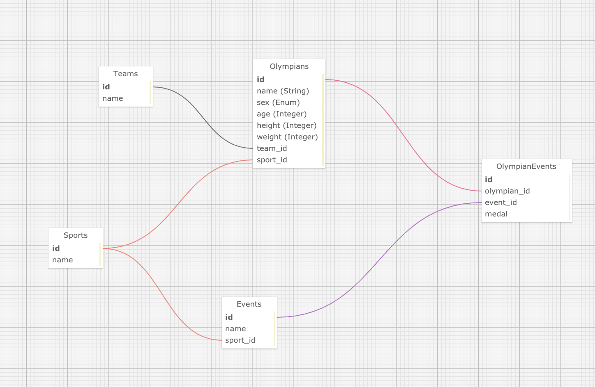

# Koroibos Olympic Analytics Tracker

## Table of Contents
- [Introduction](#introduction)
- [Initial Setup](#intial-setup)
- [How to Use](#how-to-use)
- [Known Issues](#known-issues)
- [Running Tests](#running-tests)
- [How to Contribute](#how-to-contribute)
- [Core Contributors](#core-contributors)
- [Schema Design](#schema-design)
- [Tech Stack List](#tech-stack-list)
- [Endpoints](#endpoints)
  - [Olympians Index Page](#olympians-index-page)
  - [Youngest Olympian](#youngest-olympian)
  - [Oldest Olympian](#oldest-olympian)
  - [Olympian Statistics](#olympian-statistics)

## Introduction
* Koroibos is a Ruby on Rails application that provides endpoints for a user to query for information about competitors in the 2016 Summer Olympics.  The application uses olympics data that is imported from a CSV file into the database.  ActiveRecord is used to query the database, based on the information needed for each API endpoint.

* The production app is located at https://rocky-refuge-05265.herokuapp.com/

## Initial Setup
1. Clone this repository.
1. Once it has been cloned, run `bundle`.  
1. After bundling, run `rake db:{create,migrate}`.  
1. Seed the database by running `rake import:data`.

## How to Use
* There are several endpoints in this project.  The first endpoint is used to obtain all of the olympians.  The user makes a GET request to `/api/v1/olympians`.  The response includes all of the competing olympians, including data about their name, team, age, sport and total medals won.  Below is a sample of the response:

## Known Issues
* None at this time.

## Running Tests
* The application was created with RSpec.  To run the test suite, enter `rspec` from the command line.  

## How to Contribute
* If you would desire to contribute to the project, fork the project from the master branch.  You can then make the changes you think are appropriate and submit a pull request.  Please provide a detailed explanation in the pull request of what the problem or fix is.

## Core Contributors
* This was a solo project created by Stella Mainar: https://github.com/smainar

## Schema Design


## Tech Stack List
* Ruby 2.4.6
* Ruby on Rails 5.2.3
* PostgreSQL 11.1

## Endpoints

### Olympians Index Page
* `GET api/v1/olympians`

**Response Format:**
```
{
    "data": [
        {
            "id": "7223",
            "type": "olympian",
            "attributes": {
                "id": 7223,
                "name": "Alan Campbell",
                "team": {
                    "id": 450,
                    "name": "Great Britain",
                    "created_at": "2019-11-04T03:39:39.374Z",
                    "updated_at": "2019-11-04T03:39:39.374Z"
                },
                "age": 33,
                "sport": {
                    "id": 77,
                    "name": "Rowing",
                    "created_at": "2019-11-04T03:39:37.893Z",
                    "updated_at": "2019-11-04T03:39:37.893Z"
                },
                "total_medals_won": 0
            }
        },
        {...}
    ]
}
```

### Youngest Olympian
* `GET api/v1/olympians?age=youngest`

**Response Format:**
```
{
    "data": {
        "id": "10766",
        "type": "olympian",
        "attributes": {
            "id": 10766,
            "name": "Ana Iulia Dascl",
            "team": {
                "id": 597,
                "name": "Romania",
                "created_at": "2019-11-05T16:35:16.412Z",
                "updated_at": "2019-11-05T16:35:16.412Z"
            },
            "age": 13,
            "sport": {
                "id": 125,
                "name": "Swimming",
                "created_at": "2019-11-05T16:35:17.220Z",
                "updated_at": "2019-11-05T16:35:17.220Z"
            },
            "total_medals_won": 0
        }
    }
}
```

### Oldest Olympian
* `GET api/v1/olympians?age=oldest`

**Response Format:**
```
{
    "data": {
        "id": "9897",
        "type": "olympian",
        "attributes": {
            "id": 9897,
            "name": "Julie Brougham",
            "team": {
                "id": 648,
                "name": "New Zealand",
                "created_at": "2019-11-05T16:35:18.099Z",
                "updated_at": "2019-11-05T16:35:18.099Z"
            },
            "age": 62,
            "sport": {
                "id": 115,
                "name": "Equestrianism",
                "created_at": "2019-11-05T16:35:16.723Z",
                "updated_at": "2019-11-05T16:35:16.723Z"
            },
            "total_medals_won": 0
        }
    }
}
```

### Olympian Statistics
* `GET api/v1/olympian_stats`

**Response Format:**
```
 {
    "olympian_stats": {
        "total_competing_olympians": 2856,
        "average_weight": {
            "unit": "kg",
            "male_olympians": "77.9",
            "female_olympians": "61.4"
        },
        "average_age": "26.4"
    }
}
```
